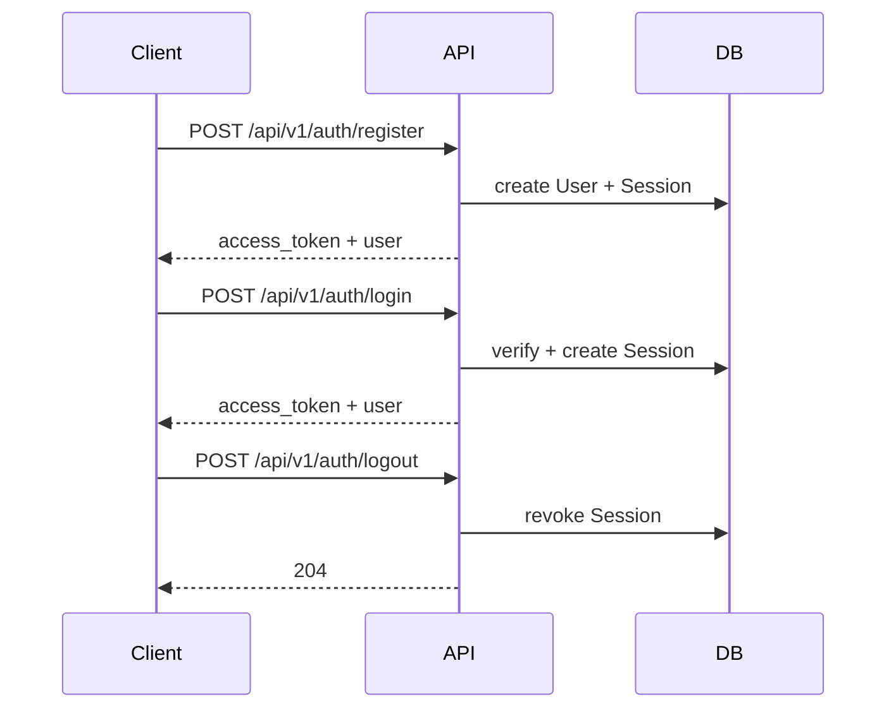

# Auth — Registration & Login

MVP email/password authentication with JWT access tokens. Data model: [`user.md`](./user.md). Decision record: [`../../decisions/2026-07-23-auth-mvp.md`](../../decisions/2026-07-23-auth-mvp.md).

## Goals

- Let users register with email + password and receive a JWT
- Let users log in and log out
- Expose current user (`/me`) for the client
- Keep Session + JWT `sid` ready for future area pinning (no pin behavior in MVP)

## User flows



### Register

1. Client submits email + password
2. API validates input; rejects duplicate email
3. API hashes password (Argon2id), creates User and Session
4. API returns `201` with `access_token`, token metadata, and public user

### Login

1. Client submits email + password
2. API looks up user by normalized email; verifies password
3. On success, creates a new Session and returns `200` with token + public user
4. On failure, returns `401` with a generic message (do not reveal whether email exists)

### Logout

1. Client sends Bearer JWT
2. API resolves Session via `sid`, sets `revoked_at`
3. Returns `204`; subsequent requests with that token fail `401`

### Current user

1. Client sends Bearer JWT
2. API validates token and Session
3. Returns public user plus `session_id` (hook for later area pin)

## API

Base path: `/api/v1/auth`

### `POST /register`

**Request**

```json
{
  "email": "user@example.com",
  "password": "string (8–128 chars)"
}
```

**Response `201`**

```json
{
  "access_token": "<jwt>",
  "token_type": "bearer",
  "expires_in": 86400,
  "user": {
    "id": "uuid",
    "email": "user@example.com",
    "created_at": "2026-07-23T14:00:00Z"
  }
}
```

**Errors:** `400` validation, `409` email already registered

### `POST /login`

**Request** — same body as register.

**Response `200`** — same shape as register success.

**Errors:** `400` validation, `401` invalid credentials

### `POST /logout`

**Auth:** `Authorization: Bearer <jwt>`

**Response:** `204` No Content

**Errors:** `401` missing, invalid, expired, or revoked token

### `GET /me`

**Auth:** `Authorization: Bearer <jwt>`

**Response `200`**

```json
{
  "user": {
    "id": "uuid",
    "email": "user@example.com",
    "created_at": "2026-07-23T14:00:00Z"
  },
  "session_id": "uuid"
}
```

`session_id` is the Session primary key (JWT `sid`). Area-pinning will attach to this session later; MVP clients may ignore it.

**Errors:** `401` missing, invalid, expired, or revoked token

## JWT

### Delivery

- Client sends `Authorization: Bearer <access_token>` on protected routes
- Store the token securely on the client (prefer memory or httpOnly patterns when available; avoid long-lived plaintext in `localStorage` if a safer option exists)
- No refresh tokens in MVP; on expiry, client re-authenticates via login

### Claims

| Claim | Meaning |
|-------|---------|
| `sub` | User `id` |
| `sid` | Session `id` |
| `exp` | Expiration (Unix time) |

Suggested MVP access lifetime: **24 hours** (`expires_in: 86400`). Align Session `expires_at` with JWT `exp`.

### Validation (server)

For every protected route:

1. Verify signature and `exp`
2. Load Session by `sid`; require valid session (not revoked, not expired)
3. Confirm `sub` matches Session `user_id`
4. Inject authenticated user (and session id) via FastAPI `Depends`

## Errors

| Status | When | Client message guidance |
|--------|------|-------------------------|
| `400` | Invalid email/password shape or length | Clear field validation messages |
| `401` | Bad login credentials | Generic: e.g. "Invalid email or password" |
| `401` | Missing/invalid/expired/revoked token | e.g. "Not authenticated" |
| `409` | Email already registered | e.g. "Email already registered" |

Do not include passwords, hashes, or stack traces in responses. Log server-side details without secrets.

## Out of scope (MVP)

- Email verification
- Password reset / change
- Refresh tokens
- OAuth / social login
- Area pinning UX or writing pin fields (Session hooks only — see [`user.md`](./user.md))
- Full user profile CRUD (separate future spec)
